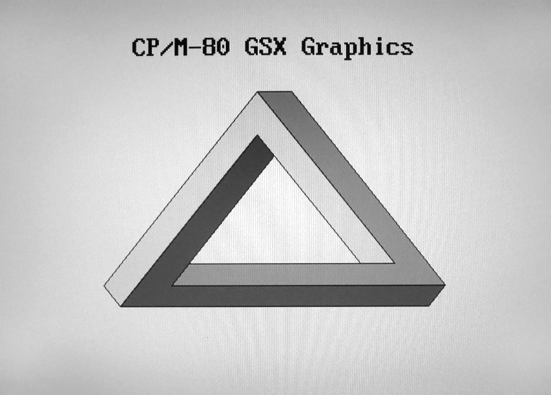

# PiGFX 
## Raspberry Pi graphics card / ANSI terminal emulator

This is a fork of https://github.com/dhansel/pigfx (which is a fork of 
https://github.com/fbergama/pigfx) with some changes to work better as a
terminal for my [RunCPM based ZCPR3.3/ZSDOS system](https://github.com/mecparts/TeensyBoardZ80)
and in general. The changes are:
- completely separate carriage return (\r, 0x0d) and line feed (\n,
0x0a) handling on input and output
- improved ANSI escape sequence support (insert lines, delete lines,
  proper erase to end/beginning of screen, underlining, private escape
  sequences for default colour choices and to print any byte value)
- GSX graphics support (a vintage CP/M portable graphics standard,
  possibly of interest to no one else on the planet!)
- moved to most recent USPi library for keyboard LED support
- properly support keyboard repeat function
- fixed 2 key rollover
- an option of true RTS/CTS handshaking (with STANDALONE_TERMINAL
  defined) or a quasi RTS output to tell the sending computer to hold up
  (toggled off when the input buffer is 3/4s full and back on when the
  buffer is down to 1/4 full)
- with STANDALONE_TERMINAL defined, a console bell using (don't laugh)
  SPI and DMA to put out an 800Hz tone for 200ms on the SPI0_MOSI pin
  (GPIO10). Yes, it's massive overkill; but the SPI perhipheral wasn't
  doing anything and I had all these DMA channels sitting idle...

I have tested this both on a 512MB Raspberry Pi B and a Pi Zero (the non
wireless version). It was built on a Raspberry Pi 3 B+ and the makefiles
have been slightly tweaked to account for that.

To install, simply copy the content of the "bin" directory into the
root directory of an empty, FAT32 formatted SD card and plug the card
into the Raspberry Pi.

The serial port is on the following pins:
- TX (out)    : GPIO14 (pin 8 of the 2-row GPIO connector)
- RX (in)     : GPIO15 (pin 10 of the 2-row GPIO connector)

With STANDALONE_TERMINAL defined:
- CTS (in)    : GPIO30 (pin 5 of the P5 header)
- RTS (out)   : GPIO31 (pin 6 of the P5 header)

Without STANDALONE_TERMINAL defined:
- "RTS" (out) : GPIO18 (pin12 of of the 2-row GPIO connector)

Note that Raspberry Pi pins are 3.3V (not 5V tolerant).

For more instructions refer to the original projects: 
https://github.com/dhansel/pigfx
https://github.com/fbergama/pigfx

# References

## GSX

[GSX-80 Graphics Extension Programmer's Guide](http://bitsavers.trailing-edge.com/pdf/digitalResearch/gsx/GSX-80_Graphics_Extension_Programmers_Guide_Nov82.pdf) 
[The Graphics System eXtension](http://seasip.info/Cpm/gsx.html) 
[Graphics with CP/M](http://www.z80.eu/gsx.html)

-----

The MIT License (MIT)

Copyright (c) 2016 Filippo Bergamasco.

Permission is hereby granted, free of charge, to any person obtaining a copy
of this software and associated documentation files (the "Software"), to deal
in the Software without restriction, including without limitation the rights
to use, copy, modify, merge, publish, distribute, sublicense, and/or sell
copies of the Software, and to permit persons to whom the Software is
furnished to do so, subject to the following conditions:

The above copyright notice and this permission notice shall be included in
all copies or substantial portions of the Software.

THE SOFTWARE IS PROVIDED "AS IS", WITHOUT WARRANTY OF ANY KIND, EXPRESS OR
IMPLIED, INCLUDING BUT NOT LIMITED TO THE WARRANTIES OF MERCHANTABILITY,
FITNESS FOR A PARTICULAR PURPOSE AND NONINFRINGEMENT. IN NO EVENT SHALL THE
AUTHORS OR COPYRIGHT HOLDERS BE LIABLE FOR ANY CLAIM, DAMAGES OR OTHER
LIABILITY, WHETHER IN AN ACTION OF CONTRACT, TORT OR OTHERWISE, ARISING FROM,
OUT OF OR IN CONNECTION WITH THE SOFTWARE OR THE USE OR OTHER DEALINGS IN
THE SOFTWARE.
